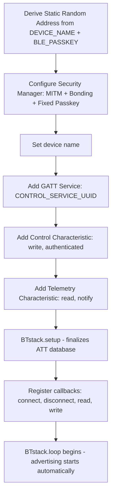

# BLE System Specification

**Version:** 1.0  
**Last Updated:** 2026-02-13  
**Status:** Production

---

## Table of Contents

### [1. BLE Configuration](#1-ble-configuration)
- [1.1 Overview](#11-overview)
- [1.2 Technology Stack](#12-technology-stack)
- [1.3 Device Identity](#13-device-identity)
- [1.4 Advertising](#14-advertising)
- [1.5 Security](#15-security)
- [1.6 Configuration Files](#16-configuration-files)
- [1.7 Boot Sequence](#17-boot-sequence)
- [1.8 Troubleshooting](#18-troubleshooting)
- [1.9 LED Status Indicator](#19-led-status-indicator)
- [1.10 File Structure](#110-file-structure)

### [2. BLE Messaging System](#2-ble-messaging-system)
- [2.1 Overview](#21-overview)
- [2.2 Architectural Principles](#22-architectural-principles)
- [2.3 System Architecture](#23-system-architecture)
- [2.4 BLE Characteristics](#24-ble-characteristics)
- [2.5 Response Flow Architecture](#25-response-flow-architecture)
- [2.6 Message Format](#26-message-format)
- [2.7 Standard Message Codes](#27-standard-message-codes)
- [2.8 Flutter App Components](#28-flutter-app-components)
- [2.9 UI Styling](#29-ui-styling)
- [2.10 Testing](#210-testing)

### [3. BLE Communication Protocol](#3-ble-communication-protocol)
- [3.1 Overview](#31-overview)
- [3.2 Control Command](#32-control-command)
- [3.3 Heartbeat](#33-heartbeat)
- [3.4 Telemetry](#34-telemetry)
- [3.5 Firmware Data Structures](#35-firmware-data-structures)
- [3.6 Safety](#36-safety)

---

# 1. BLE Configuration

## 1.1 Overview

This section specifies the BLE configuration for the Pico W Remote Controller firmware. It covers device identity, advertising, security/pairing, and connection management.

| Role | Component | Technology |
|------|-----------|------------|
| **Peripheral** | Raspberry Pi Pico W (RP2040) | BTstack (bundled with Arduino-Pico core) |
| **Central** | Flutter Mobile App | flutter_blue_plus |

---

## 1.2 Technology Stack

| Component | Specification |
|-----------|---------------|
| **BLE Library (Firmware)** | BTstack (integrated into earlephilhower Arduino-Pico core) |
| **Framework** | Arduino on RP2040 |
| **BLE Library (App)** | flutter_blue_plus |

### Why BTstack?

- Bundled with the Arduino-Pico core; no separate installation needed
- Supports GATT server, Security Manager, and Static Random Addresses
- Compatible with the same BLE protocol used by the ESP32 firmware
- Handles BLE event loop on Core 0 via `BTstack.loop()` in `loop()`

### Differences from ESP32 (Bluedroid)

| Feature | ESP32 (Bluedroid) | Pico W (BTstack) |
|---------|-------------------|-------------------|
| BLE library | ESP-IDF native Bluedroid | BTstack (Arduino wrapper) |
| GATT setup | Step-by-step `esp_ble_gatts_*` calls | `BTstack.addGATTService()` + `addGATTCharacteristic()` |
| Security config | `esp_ble_gap_set_security_param()` | `sm_set_authentication_requirements()` |
| Address setting | `esp_ble_gap_set_rand_addr()` | `gap_random_address_set()` |
| Event loop | Callback-driven (FreeRTOS tasks) | Polled via `BTstack.loop()` in Arduino `loop()` |

> [!NOTE]
> Despite the different BLE libraries, the **over-the-air protocol is identical**. The same Flutter app connects to both ESP32 and Pico W robots without any changes.

---

## 1.3 Device Identity

### 1.3.1 Static Random Address

The BLE MAC address is **derived from device name + passkey** using a CRC16 hash:

```cpp
// Build identity string
char identity[64];
snprintf(identity, sizeof(identity), "%s%lu", DEVICE_NAME, (unsigned long)BLE_PASSKEY);
uint16_t hash = crc16_le(0, (uint8_t*)identity, strlen(identity));

// Build Static Random Address (BLE spec: upper 2 bits = 11)
uint8_t addr[6];
addr[0] = 0xC0 | ((hash >> 8) & 0x3F);
addr[1] = hash & 0xFF;
addr[2] = (hash >> 8) ^ 0xAA;
addr[3] = hash ^ 0x55;
addr[4] = ((hash >> 4) & 0xFF) ^ 0x33;
addr[5] = (hash ^ 0x77) & 0xFF;

gap_random_address_set(addr);
```

The `crc16_le()` function uses the same CRC16-CCITT polynomial as ESP-IDF's `esp_crc16_le()`. This ensures that the **same DEVICE_NAME + BLE_PASSKEY produces the same MAC on both Pico W and ESP32**.

### 1.3.2 Identity Behavior

| Scenario | MAC Address | Result |
|----------|-------------|--------|
| Rename device | Changes | Phone sees new device, must re-pair |
| Change passkey | Changes | Phone sees new device, must re-pair |
| Power cycle | Unchanged | Phone auto-reconnects |
| Same identity | Unchanged | Bonding preserved |

### 1.3.3 Device Name (App-Side)

Always use advertising name (`advName`), not cached platform name:

```dart
String name = result.advertisementData.advName.isNotEmpty 
    ? result.advertisementData.advName 
    : result.device.platformName;
```

---

## 1.4 Advertising

| Parameter | Value |
|-----------|-------|
| Interval | 50-100 ms |
| Type | Connectable, Undirected |
| Address Type | Random Static |
| Name in advertisement | `DEVICE_NAME` from `project_config.h` |

---

## 1.5 Security

### 1.5.1 Pairing Configuration

| Parameter | Value |
|-----------|-------|
| Authentication | Passkey Entry (6-digit PIN) |
| IO Capability | Display Only |
| Security Mode | MITM protection + Bonding |
| Default Passkey | Configured in `project_config.h` as `BLE_PASSKEY` |

### 1.5.2 Firmware Setup

```cpp
// BTstack Security Manager configuration
sm_set_authentication_requirements(SM_AUTHREQ_SECURE_CONNECTION | SM_AUTHREQ_MITM_PROTECTION | SM_AUTHREQ_BONDING);
sm_set_io_capabilities(IO_CAPABILITY_DISPLAY_ONLY);

// Fixed passkey (from project_config.h)
uint32_t passkey = BLE_PASSKEY;
sm_use_fixed_passkey_in_display_role(passkey);
```

### 1.5.3 Bonding

- Bonds are stored in flash and persist across reboots
- Do NOT clear bonds on startup
- Bonds invalidate when identity (name/passkey) changes
- On iOS, the system-level pairing dialog appears asking for the passkey

### 1.5.4 Authenticated Writes

The control characteristic requires authenticated encryption. If a client connects but does not complete pairing, writes will be rejected. The firmware tracks the first successful write to confirm that the app is fully authenticated and sending data.

---

## 1.6 Configuration Files

### 1.6.1 Firmware: `project_config.h`

```cpp
#define DEVICE_NAME "TimberBot_RC"
#define BLE_PASSKEY 123456
```

### 1.6.2 Firmware: `ble_config.h`

```cpp
#define CONTROL_SERVICE_UUID  "4fafc201-1fb5-459e-8fcc-c5c9c331914b"
#define CONTROL_CHAR_UUID     "beb5483e-36e1-4688-b7f5-ea07361b26a8"
#define TELEMETRY_CHAR_UUID   "beb5483f-36e1-4688-b7f5-ea07361b26a8"

#define BLE_ATT_MAX_VALUE_LEN   512
#define BLE_CONN_INTERVAL_MIN   6    // 6 x 1.25ms = 7.5ms
#define BLE_CONN_INTERVAL_MAX   24   // 24 x 1.25ms = 30ms
```

---

## 1.7 Boot Sequence



> [!WARNING]
> `BTstack.setup()` must be called LAST because it finalizes the ATT database. Adding characteristics after `setup()` will silently fail.

---

## 1.8 Troubleshooting

| Issue | Cause | Solution |
|-------|-------|----------|
| Robot not appearing in scan list | BLE not advertising | Check serial for `[BLE] Advertising started`. If missing, BTstack init failed. |
| Phone shows old name | Cached from previous bonding | Use `advName`, not `platformName` in Flutter app |
| Can't connect after rename | Old bond invalid | "Forget" device on phone, re-pair |
| Passkey not prompted | Already bonded | Expected behavior; passkey is only requested on first pairing |
| Connected but no motor response | UUID mismatch | Compare UUIDs in `ble_config.h` with Flutter app's `ble_constants.dart` |
| Connects then disconnects immediately | Characteristic mismatch | Verify service and characteristic UUIDs match across all three codebases |
| "New device" after firmware update | MAC address changed | You changed `DEVICE_NAME` or `BLE_PASSKEY`. Delete old pairing, re-pair. |
| Intermittent disconnects | Range or BTstack loop stall | Move closer. Ensure `loop()` calls `BTstack.loop()` without long blocking delays. |

---

## 1.9 LED Status Indicator

The Pico W has a built-in LED (active HIGH on the CYW43 WiFi chip, not a standard GPIO).

| State | LED Behavior | Description |
|-------|--------------|-------------|
| Advertising | OFF | Waiting for connection |
| Connected | ON (solid) | Device connected and authenticated |
| Disconnected | OFF | Returns to advertising automatically |

### Configuration

The LED is controlled in `ble_controller.cpp` via the connect/disconnect callbacks:

```cpp
void deviceConnectedCallback(BLEStatus status, BLEDevice *device) {
    digitalWrite(LED_BUILTIN, HIGH);  // LED ON
    // ... pairing and state setup
}

void deviceDisconnectedCallback(BLEDevice *device) {
    digitalWrite(LED_BUILTIN, LOW);   // LED OFF
    // ... motor stop and state cleanup
}
```

---

## 1.10 File Structure

```
firmwares/pico/src/
├── main.cpp              # Boot sequence, BTstack.loop() in loop()
├── project_config.h      # DEVICE_NAME, BLE_PASSKEY
│
└── core/
    ├── ble_config.h      # UUIDs, MTU, connection intervals
    ├── ble_controller.cpp # GATT server, address derivation, callbacks
    ├── ble_controller.h   # Public API: ble_init(), ble_update(), ble_is_connected()
    └── command_parser.cpp # JSON parsing (called from gattWriteCallback)
```

---

# 2. BLE Messaging System

## 2.1 Overview

This section specifies a **bidirectional JSON-based messaging system** over BLE between the firmware and the Flutter mobile application. The architecture follows a **push-based model** where functional drivers (motors, sensors, battery, etc.) are responsible for detecting their own issues and sending messages to the user via a transport layer.

> [!NOTE]
> The messaging system is currently implemented on the ESP32 firmware. The Pico W firmware does not yet implement `ble_messages`. This section documents the protocol specification so that Pico-side implementation will be compatible with the existing Flutter app and ESP32 protocol.

---

## 2.2 Architectural Principles

### 2.2.1 Core Design Philosophy

> **BLE is a dumb transport layer. It does NOT know about motors, tuning, batteries, or any application-specific logic.**

Each functional driver is responsible for:
1. **Detecting its own issues** (e.g., motor drift, encoder failure, low battery)
2. **Calling the BLE messaging API** when something needs user attention
3. **Handling user responses** via registered callbacks

### 2.2.2 Anti-Pattern (What NOT to do)

```
❌ WRONG: BLE polls modules for status
   BLE → "do you need tuning?" → Motor
   BLE → "are you low?" → Battery
   BLE → "any errors?" → Encoder
```

### 2.2.3 Correct Pattern (What TO do)

```
✅ CORRECT: Modules push messages via BLE transport
   Motor detects issue → calls ble::send_warning(...)
   Battery detects low → calls ble::send_warning(...)
   Encoder detects fault → calls ble::send_error(...)
```

---

## 2.3 System Architecture

```
┌─────────────────────────────────────────────────────────────────────────────┐
│                           FIRMWARE                                          │
├─────────────────────────────────────────────────────────────────────────────┤
│                                                                             │
│  ┌─────────────────┐ ┌─────────────────┐ ┌─────────────────┐                │
│  │  Motor Manager  │ │    Battery      │ │    Encoder      │                │
│  │  (monitors PID) │ │   (monitors V)  │ │ (monitors RPM)  │                │
│  └────────┬────────┘ └────────┬────────┘ └────────┬────────┘                │
│           │                   │                   │                         │
│           └───────────────────┼───────────────────┘                         │
│                               │                                             │
│                               ▼  Functional modules CALL transport          │
│                    ┌─────────────────────────┐                              │
│                    │    BLE Messages         │                              │
│                    │   (Transport Layer)     │                              │
│                    │                         │                              │
│                    │  • send_info()          │                              │
│                    │  • send_warning()       │                              │
│                    │  • send_error()         │                              │
│                    │  • send_message()       │                              │
│                    │  • register_callback()  │                              │
│                    └───────────┬─────────────┘                              │
│                                │                                            │
│                                ▼                                            │
│                    ┌─────────────────────────┐                              │
│                    │       BLE GATT          │                              │
│                    │  (Telemetry Notify)     │                              │
│                    └───────────┬─────────────┘                              │
│                                │                                            │
└────────────────────────────────┼────────────────────────────────────────────┘
                                 │
                    BLE Telemetry Characteristic (Notify)
                                 │
                                 ▼
┌─────────────────────────────────────────────────────────────────────────────┐
│                           FLUTTER APP                                       │
├─────────────────────────────────────────────────────────────────────────────┤
│                                                                             │
│  ┌─────────────────┐     ┌─────────────────┐     ┌─────────────────┐        │
│  │   BLE Service   │───▶│ Message Service │────▶│ Message Overlay │        │
│  │  (Telemetry RX) │     │   (Parser)      │     │  (UI Cards)     │        │
│  └────────┬────────┘     └────────┬────────┘     └─────────────────┘        │
│           │                       │                                         │
│           │                       ▼                                         │
│           │              ┌─────────────────┐                                │
│           │              │ onActionSelected│                                │
│           │              │   Callback      │                                │
│           └──────────────┴────────┬────────┘                                │
│                                   │                                         │
│                                   ▼                                         │
│                    Send response via Command Characteristic                 │
│                                                                             │
└─────────────────────────────────────────────────────────────────────────────┘
```

---

## 2.4 BLE Characteristics

### 2.4.1 Telemetry Characteristic (Firmware → App)

| Property | Value |
|----------|-------|
| UUID | `beb5483f-36e1-4688-b7f5-ea07361b26a8` |
| Direction | Firmware → App (Notify) |
| Purpose | Send JSON messages and telemetry to app |
| Max Size | MTU negotiated (typically 512 bytes) |

### 2.4.2 Command Characteristic (App → Firmware)

| Property | Value |
|----------|-------|
| UUID | `beb5483e-36e1-4688-b7f5-ea07361b26a8` |
| Direction | App → Firmware (Write) |
| Purpose | Send control commands AND message responses |

---

## 2.5 Response Flow Architecture

When a user clicks an action button on a message card, the response flows through the system:

```
┌─────────────────────────────────────────────────────────────────────────────┐
│                           FLUTTER APP                                       │
├─────────────────────────────────────────────────────────────────────────────┤
│                                                                             │
│  1. User clicks [Start Tuning] button on MessageOverlay                     │
│           │                                                                 │
│           ▼                                                                 │
│  2. MessageOverlay calls MessageService.handleAction(message, action)       │
│           │                                                                 │
│           ▼                                                                 │
│  3. MessageService invokes onActionSelected callback                        │
│           │                                                                 │
│           ▼                                                                 │
│  4. BLEService.sendCommand() writes JSON to Command Characteristic:         │
│     {                                                                       │
│       "type": "message_response",                                           │
│       "id": "msg_001",                                                      │
│       "action": "confirm"                                                   │
│     }                                                                       │
│           │                                                                 │
└───────────┼─────────────────────────────────────────────────────────────────┘
            │
            │  BLE Write to Command Characteristic (UUID: beb5483e-...)
            ▼
┌─────────────────────────────────────────────────────────────────────────────┐
│                           FIRMWARE                                          │
├─────────────────────────────────────────────────────────────────────────────┤
│                                                                             │
│  5. gattWriteCallback triggered                                             │
│           │                                                                 │
│           ▼                                                                 │
│  6. command_parser: command_parse(data, len)                                │
│           │                                                                 │
│           │  Parses JSON and checks "type" field:                           │
│           │                                                                 │
│           ├─── "control"            → Motion controller                     │
│           ├─── "heartbeat"          → Connection keepalive                  │
│           └─── "message_response"  ─┐                                       │
│                                     │                                       │
│  7.                                 ▼                                       │
│        ble_messages: handle_response(json)                                  │
│           │                                                                 │
│           │  Parses response JSON:                                          │
│           │  • Extracts message ID ("msg_001" → 1)                          │
│           │  • Extracts action ID ("confirm")                               │
│           │                                                                 │
│           ▼                                                                 │
│  8. Dispatch to ALL registered callbacks:                                   │
│                                                                             │
│     for (auto& callback : s_responseCallbacks) {                            │
│         callback(msgId, actionId);                                          │
│     }                                                                       │
│           │                                                                 │
│           │  Each functional module receives the response                   │
│           │                                                                 │
│           ├───────────────────┬───────────────────┐                         │
│           ▼                   ▼                   ▼                         │
│     ┌───────────┐       ┌───────────┐       ┌───────────┐                   │
│     │ Motor     │       │ Battery   │       │ Other     │                   │
│     │ Manager   │       │ Monitor   │       │ Module    │                   │
│     │ callback  │       │ callback  │       │ callback  │                   │
│     └─────┬─────┘       └───────────┘       └───────────┘                   │
│           │                                                                 │
│           ▼                                                                 │
│  9. Module handles response (e.g., starts autotune)                         │
│                                                                             │
└─────────────────────────────────────────────────────────────────────────────┘
```

### 2.5.1 Key Files in Response Chain

| Step | File | Function |
|------|------|----------|
| 4 | `lib/services/ble_service.dart` | `sendCommand()` |
| 5 | `core/ble_controller.cpp` | `gattWriteCallback()` |
| 6 | `core/command_parser.cpp` | `command_parse()` |
| 7 | `core/ble_messages.cpp` | `handle_response()` (Pico: not yet implemented) |
| 8 | `core/ble_messages.cpp` | Callback dispatch loop |
| 9 | `core/motor_manager.cpp` | Registered callback |

### 2.5.2 Registering a Response Callback

Each module that sends messages with action buttons must register a callback to handle responses:

```cpp
// In motor_manager.cpp or other functional module

void init_motor_messaging() {
    // Register callback to handle user responses
    ble::register_response_callback([](uint32_t msgId, const char* actionId) {
        Serial.printf("Received response for msg %lu: action=%s\n", msgId, actionId);
        
        if (strcmp(actionId, "confirm") == 0) {
            // User confirmed - start the requested operation
            start_motor_autotune();
        } else if (strcmp(actionId, "dismiss") == 0) {
            // User dismissed - do nothing or schedule reminder
            Serial.printf("User dismissed tuning request\n");
        }
    });
}
```

### 2.5.3 Response JSON Format

```json
{
  "type": "message_response",
  "id": "msg_001",
  "action": "confirm"
}
```

| Field | Type | Description |
|-------|------|-------------|
| `type` | string | Always `"message_response"` |
| `id` | string | The original message ID (e.g., `"msg_001"`) |
| `action` | string | The action button ID that was clicked |

### 2.5.4 Multiple Callbacks

Multiple modules can register callbacks. When a response is received, ALL registered callbacks are invoked:

```cpp
// Module A registers
ble::register_response_callback(moduleA_handler);

// Module B registers  
ble::register_response_callback(moduleB_handler);

// When response received: BOTH are called
// Each module should check if the message ID is relevant to them
```

---

## 2.6 Message Format

### 2.6.1 Firmware → App (JSON Schema)

```json
{
  "type": "message",
  "id": "msg_001",
  "severity": "info",
  "code": "MESSAGE_CODE",
  "title": "Short Title",
  "body": "Detailed message body...",
  "actions": [
    {"id": "confirm", "label": "OK"},
    {"id": "cancel", "label": "Cancel"}
  ]
}
```

| Field | Type | Required | Description |
|-------|------|----------|-------------|
| `type` | string | Yes | Always `"message"` |
| `id` | string | Yes | Auto-generated unique ID (e.g., `"msg_001"`) |
| `severity` | string | Yes | `"info"`, `"warning"`, `"error"`, or `"success"` |
| `code` | string | Yes | Machine-readable message code (e.g., `"TUNE_REQUIRED"`) |
| `title` | string | Yes | Short human-readable title |
| `body` | string | Yes | Detailed message text |
| `actions` | array | No | Action buttons. Omit for notification-only messages. |

### 2.6.2 Severity Levels

| Severity | Meaning | App Color Accent |
|----------|---------|-----------------|
| `info` | Informational (no action needed) | Muted blue (`#5B9BD5`) |
| `warning` | Needs attention | Warm amber (`#E8A838`) |
| `error` | Critical issue | Soft red (`#E06C75`) |
| `success` | Operation completed | Soft green (`#7EC699`) |

### 2.6.3 App → Firmware (Response JSON)

```json
{
  "type": "message_response",
  "id": "msg_001",
  "action": "confirm"
}
```

---

## 2.7 Standard Message Codes

### 2.7.1 Motor/PID Messages

| Code | Severity | Trigger | Description |
|------|----------|---------|-------------|
| `TUNE_REQUIRED` | warning | Motor `needsTuning()` flag | Motors need PID calibration |
| `TUNE_PROGRESS` | info | During autotuning | Tuning in progress (with progress %) |
| `TUNE_COMPLETE` | success | Autotune finished | Tuning completed, gains saved |
| `TUNE_FAILED` | error | Autotune failed | Tuning failed, gains unchanged |

### 2.7.2 System Messages

| Code | Severity | Trigger | Description |
|------|----------|---------|-------------|
| `LOW_BATTERY` | warning | Voltage < threshold | Battery needs charging |
| `ENCODER_FAULT` | error | No pulses detected | Encoder hardware issue |
| `MOTOR_STALL` | error | Current spike + no RPM | Motor stalled |
| `CONNECTION_TEST` | info | On connection (debug) | BLE pipeline verified |

---

## 2.8 Flutter App Components

### 2.8.1 MessageService (`lib/services/message_service.dart`)

- **Parses incoming JSON** from telemetry stream
- **Manages active messages** (add, update, dismiss)
- **Routes action callbacks** back to BLE service
- **Exposes messages stream** to UI via `messagesStream`

### 2.8.2 MessageOverlay (`lib/widgets/message_overlay.dart`)

- **Displays message cards** at top of controller screen
- **Severity-based styling** (color accents, icons)
- **Action buttons** wired to MessageService
- **Non-intrusive**: does not block joystick controls

### 2.8.3 BLEService Integration (`lib/services/ble_service.dart`)

```dart
// On telemetry received, route to MessageService
_characteristicSubscription = characteristic.onValueReceived.listen((value) {
    final jsonStr = String.fromCharCodes(value);
    MessageService().onTelemetryReceived(jsonStr);
});

// Wire action callback to send responses
MessageService().onActionSelected = (String messageId, String actionId) async {
    final response = jsonEncode({
        'type': 'message_response',
        'id': messageId,
        'action': actionId,
    });
    await sendCommand(response.codeUnits);
};
```

### 2.8.4 File Locations

| Platform | File | Purpose |
|----------|------|---------|
| **Flutter** | `lib/models/vehicle_message.dart` | Message data model |
| **Flutter** | `lib/services/message_service.dart` | Parsing and management |
| **Flutter** | `lib/widgets/message_overlay.dart` | UI card display |
| **Flutter** | `lib/services/ble_service.dart` | BLE integration |
| **Flutter** | `lib/screens/controller_screen.dart` | Overlay integration |

---

## 2.9 UI Styling

### 2.9.1 Color Palette

All message cards use a **dark muted background** (`#1E2530`) with **colored accents** based on severity:

| Severity | Accent Color | Icon |
|----------|-------------|------|
| info | `#5B9BD5` (muted blue) | `info_outline` |
| warning | `#E8A838` (warm amber) | `warning_amber_rounded` |
| error | `#E06C75` (soft red) | `error_outline` |
| success | `#7EC699` (soft green) | `check_circle_outline` |

### 2.9.2 Button Styling

- **Primary button**: Accent color background, white text
- **Secondary button**: Dark gray (`#3A4250`), white text
- **Rounded corners**: 8px border radius
- **Padding**: 20px horizontal, 10px vertical

---

## 2.10 Testing

### 2.10.1 Verify Message Sending (Firmware)

Check serial monitor for:
```
[BLE_MSG] TX: {"type":"message","id":"msg_001",...}
[BLE_GATT] send_telemetry: OK!
```

### 2.10.2 Verify Message Display (App)

1. Connect to device
2. Watch Flutter debug console for: `<<< BLE RX: {...}`
3. Message card should appear at top of controller screen

### 2.10.3 Verify Response Handling

1. Click action button on message card
2. Flutter console shows: `>>> Sending message response: {...}`
3. Firmware serial shows: `[BLE_MSG] RX: {...}`

---

# 3. BLE Communication Protocol

## 3.1 Overview

This section defines the JSON message format for communication between the mobile app and robot over BLE.

**Scope:**
- **Control commands:** App → Robot (joystick, dial, slider inputs)
- **Heartbeat:** App → Robot (keep-alive when idle)
- **Telemetry:** Robot → App (battery, signal strength, status)
- **Messages:** Robot → App (warnings, errors, action requests)

**Transport:**
- BLE GATT characteristic writes (commands) and notifications (telemetry/messages)
- See [Section 2.4](#24-ble-characteristics) for UUIDs and connection details

---

## 3.2 Control Command

Sent from app to robot at approximately 50Hz while the joystick is active.

```json
{
  "type": "control",
  "vehicle": "mecanum",
  "left": {"control": "dial", "value": 45.0},
  "right": {"control": "joystick", "x": 50.0, "y": -30.0},
  "speed": 80,
  "aux": [0, 0, 0, 0, 0, 0],
  "toggles": [false, false, false, false, false, false]
}
```

### 3.2.1 Fields

| Field | Type | Description |
|-------|------|-------------|
| `type` | string | `"control"` or `"heartbeat"` |
| `vehicle` | string | `"mecanum"`, `"fourwheel"`, `"tracked"`, `"dual"` |
| `left` | object | Left controller input |
| `right` | object | Right controller input |
| `speed` | int | Speed limit 0-100% |
| `aux` | array | 6 auxiliary channels (-100 to +100 each) |
| `toggles` | array | 6 toggle switch states |

### 3.2.2 Controller Types

There are **3 control types**. Each object contains a `control` field specifying the type.

#### Dial

A rotary dial for steering or rotation control. Returns angle in degrees.

```json
{"control": "dial", "value": 45.0}
```

| Field | Type | Range | Description |
|-------|------|-------|-------------|
| `control` | string | `"dial"` | Identifier |
| `value` | float | -135 to +135 | Rotation angle in degrees. 0 = center, negative = left, positive = right |

**Used by:** Mecanum (steering), Four-wheel (steering)

#### Joystick

A 2-axis joystick for omnidirectional movement. Returns X and Y position.

```json
{"control": "joystick", "x": 50.0, "y": -30.0}
```

| Field | Type | Range | Description |
|-------|------|-------|-------------|
| `control` | string | `"joystick"` | Identifier |
| `x` | float | -100 to +100 | Horizontal axis. Negative = left, positive = right |
| `y` | float | -100 to +100 | Vertical axis. Negative = backward, positive = forward |

**Used by:** Mecanum (translation), Dual joystick (both sides)

#### Slider

A linear slider for throttle or single-axis control. Returns value along axis.

```json
{"control": "slider", "value": 75.0}
```

| Field | Type | Range | Description |
|-------|------|-------|-------------|
| `control` | string | `"slider"` | Identifier |
| `value` | float | -100 to +100 | Slider position. Negative = backward/down, positive = forward/up |

**Used by:** Tracked (left/right tracks), Four-wheel (throttle)

### 3.2.3 Vehicle Type → Controller Mapping

| Vehicle | Left Controller | Right Controller |
|---------|-----------------|------------------|
| `mecanum` | dial | joystick |
| `fourwheel` | dial | slider |
| `tracked` | slider | slider |
| `dual` | joystick | joystick |

---

## 3.3 Heartbeat

Sent every 1 second when no control commands are active. This serves as a keep-alive signal and safety watchdog; if the robot fails to receive a heartbeat or control packet within a timeout period, it will automatically stop all motors to prevent runaway behavior.

```json
{"type": "heartbeat"}
```

---

## 3.4 Telemetry

Sent from robot to app periodically (currently reserved for future implementation on Pico W).

```json
{
  "type": "telemetry",
  "battery": 85,
  "rssi": -50,
  "heading": 180.5,
  "status": "ok"
}
```

### 3.4.1 Fields

| Field | Type | Description |
|-------|------|-------------|
| `battery` | int | 0-100% |
| `rssi` | int | Signal strength (dBm) |
| `heading` | float | 0-360 degrees (optional) |
| `status` | string | `"ok"`, `"warning"`, `"error"` |

---

## 3.5 Firmware Data Structures

Located in `core/command_packet.h`:

```cpp
#define AUX_CHANNEL_COUNT 6
#define TOGGLE_COUNT      6

typedef struct {
    bool isJoystick;   // true = 2-axis (x,y), false = 1-axis (value)
    float x;           // -100 to +100 (joystick horizontal)
    float y;           // -100 to +100 (joystick vertical)
    float value;       // -100 to +100 (dial rotation or slider position)
} joystick_input_t;

typedef struct {
    char type[16];                // "control" or "heartbeat"
    char vehicle[16];             // "mecanum", "fourwheel", "tracked", "dual"
    joystick_input_t left;        // Left controller input
    joystick_input_t right;       // Right controller input
    uint8_t speed;                // 0-100% speed multiplier
    float aux[AUX_CHANNEL_COUNT]; // 6 auxiliary channels
    bool toggles[TOGGLE_COUNT];   // 6 toggle switches
} control_command_t;
```

### JSON Framing Over BLE

BLE sends data in chunks (up to MTU size, typically 20-512 bytes). A single JSON command may arrive in one or multiple BLE writes. The firmware detects where one command ends and the next begins using two methods:

1. **Newline delimiter (`\n`):** The Flutter app appends a newline after each JSON object. This is the primary framing method.
2. **Brace counting:** As a fallback, the firmware counts `{` and `}` characters. When the count returns to zero, the JSON is complete.

---

## 3.6 Safety

| Feature | Behavior |
|---------|----------|
| Command timeout | Motors stop if no command or heartbeat for `SAFETY_TIMEOUT_MS` (default 2000ms) |
| BLE disconnect | Motors stop immediately via disconnect callback |
| Heartbeat | Keeps connection alive when joystick is idle |
| Dual-layer protection | Watchdog and disconnect callback are independent; if one fails, the other acts as backup |
